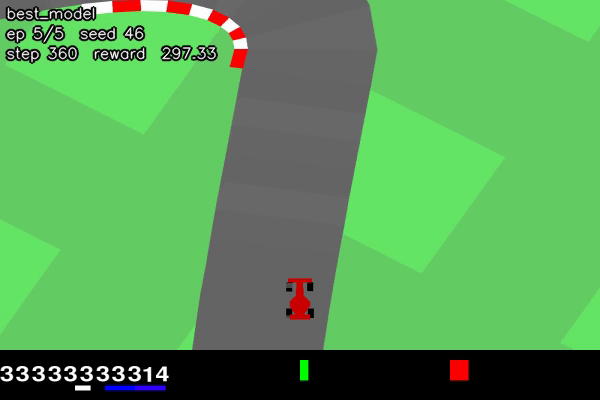
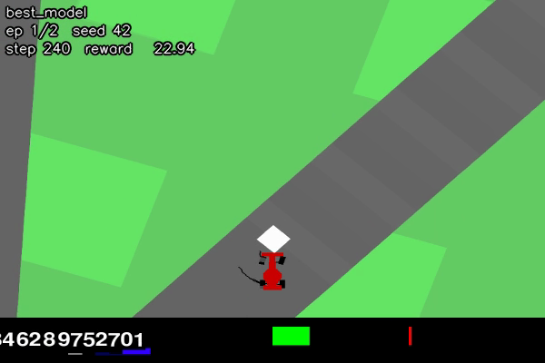
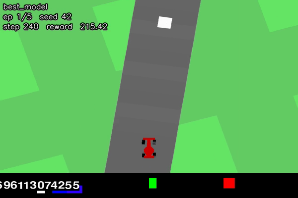
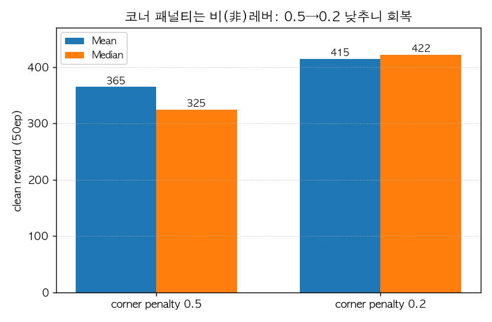
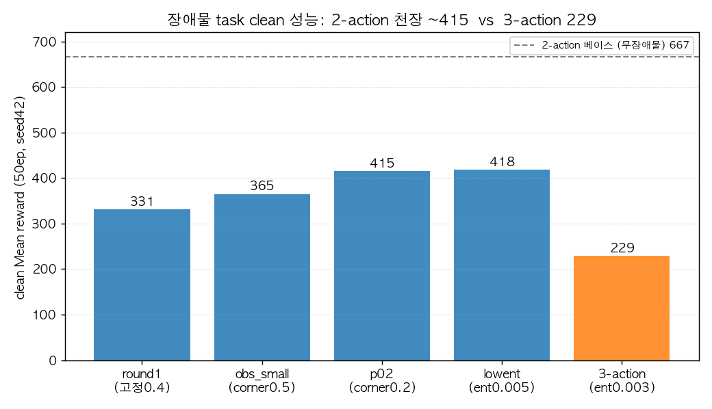
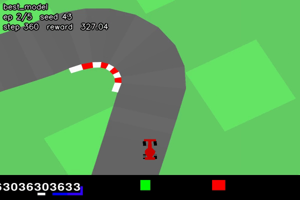
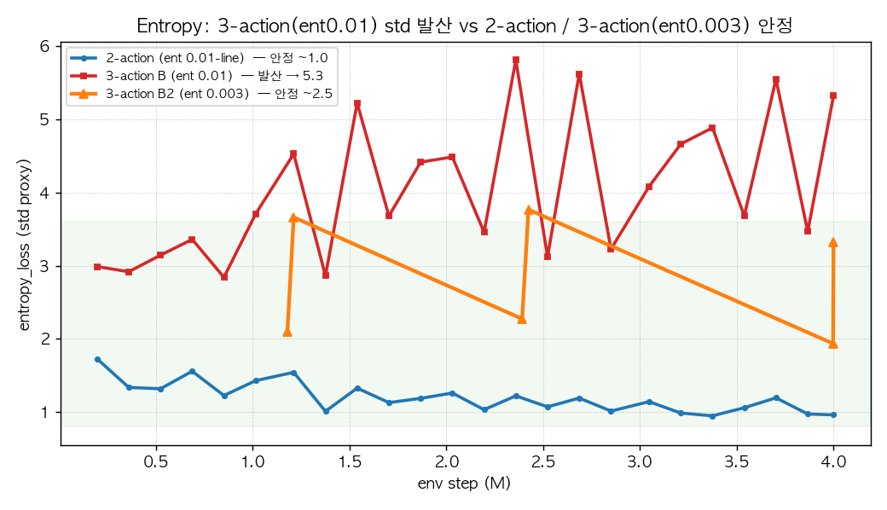
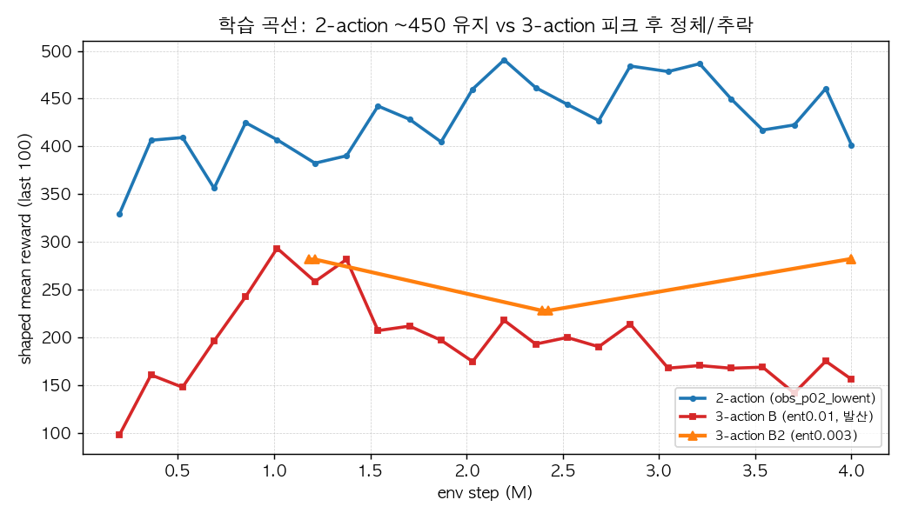

# AICarRacing 종합 기술 보고서 {-}

**2-Action PPO 에이전트: 무장애물 학습 → 장애물 회피 확장 → 2 vs 3 Action 대조 실험**

팀 B · 2026-06-15 · 환경: Gymnasium CarRacing-v3 / CarRacingObstacles-v0

> 본 문서는 채점 루브릭 순서를 따른다. **Part 0**(실행 환경·설치 / 문제·State·Reward 정의 / PPO 이론) → **Part I**(2-action 학습 + 3-action 비교, 무장애물) → **Part II**(장애물 입력 추가: 환경·round-1·크기·진단·엔트로피·**2 vs 3 action 대조**). 표는 원문 그대로, 그림·주행 프레임은 관련 절에 삽입했다.

```{=openxml}
<w:p><w:r><w:br w:type="page"/></w:r></w:p>
```

# Part 0 — 실행 환경 · 문제 정의(State/Reward) · 알고리즘

## 0. 실행 환경 및 설치 (재현성)

본 프로젝트는 **학습**과 **평가/녹화**를 서로 다른 환경에서 수행한다. 무거운 PPO 학습은 원격 A100 GPU 서버(conda 환경 `teamB_env`, CUDA 빌드 PyTorch)에서, 학습이 끝난 체크포인트의 평가·영상 녹화는 로컬 macOS(conda 환경 `racing`, CPU)에서 진행했다. 아래 버전은 로컬 `racing` 환경에서 `importlib.metadata`로 실측한 값이며, 채점 환경 재현 시 그대로 맞추면 된다.

### 0.1 사용 환경 / 버전

| 구분 | 패키지 / 항목 | 버전 | 용도 |
|------|---------------|------|------|
| 공통 | Python | 3.11.15 | 인터프리터 |
| 학습(원격) | 환경 | conda `teamB_env` / A100 CUDA | PPO 학습 (GPU) |
| 평가·녹화(로컬) | 환경 | conda `racing` / macOS CPU | 체크포인트 평가, mp4 녹화 |
| 딥러닝 | torch | 2.12.0 (로컬 CPU 빌드) | 학습/추론 — 원격 학습은 `teamB_env`의 CUDA 빌드 torch 사용 |
| 강화학습 | gymnasium | 1.3.0 | 환경 API (CarRacing) |
| 물리엔진 | box2d-py | 2.3.8 | CarRacing/Box2D 물리 (`gymnasium[box2d]`가 끌어옴) |
| 렌더링 | pygame | 2.6.1 | 환경 렌더링 (`gymnasium[box2d]`가 끌어옴) |
| 영상 전처리 | **opencv-python (cv2)** | 4.x | grayscale 변환 (`src/env_wrappers.py`의 `import cv2`) — **필수** |
| 수치연산 | numpy | 2.4.6 | 배열 연산 |
| 녹화 | imageio / imageio-ffmpeg | 2.37.3 / 0.6.0 | mp4 영상 저장 |
| 로깅·시각화 | tensorboard / matplotlib | 2.20.0 / 3.10.9 | 학습 곡선, 그림 |

> 제출물에 **`requirements.txt`를 동봉**했다(`pip install -r requirements.txt`). 아래는 그 내용을 풀어 쓴 것이다.

### 0.2 설치 (기존 실습 docker image에 추가 설치)

기존 실습용 docker base image를 그대로 사용하되, 아래 pip 패키지만 추가로 설치하면 된다.

복붙용 한 줄(권장):

```bash
pip install "torch>=2.6" "gymnasium[box2d]==1.3.0" opencv-python numpy==2.4.6 imageio==2.37.3 imageio-ffmpeg==0.6.0 tensorboard==2.20.0 matplotlib==3.10.9
```

개별 줄(필요한 것만 골라 설치):

```bash
# base 이미지에 PyTorch가 이미 있으면 아래 torch 줄은 건너뛴다.
# (단, 체크포인트 로드에 torch>=2.6 필요 — 0.4 참조)
pip install "torch>=2.6"

pip install "gymnasium[box2d]==1.3.0"   # CarRacing 환경 + Box2D 물리 + pygame(렌더링)을 함께 끌어옴
pip install opencv-python                # ★ 필수: src/env_wrappers.py 의 cv2 (없으면 모든 스크립트가 import 단계에서 ModuleNotFoundError: cv2)
pip install numpy==2.4.6
pip install imageio==2.37.3 imageio-ffmpeg==0.6.0   # mp4 녹화(record_video.py)
pip install tensorboard==2.20.0 matplotlib==3.10.9  # 로깅 / 그림
```

> **각주 (Box2D 설치):** `gymnasium[box2d]`는 `box2d-py`(본 환경 2.3.8)와 `pygame`을 함께 설치한다. extras 설치가 실패하면 `pip install box2d-py pygame`로 직접 설치할 수 있다. 일부 환경에서는 C++ 바인딩 빌드를 위해 `swig`가 필요하다(예: `apt-get install -y swig` 또는 `conda install -c conda-forge swig` 후 재시도). `pygame`을 별도 버전으로 핀하면 `gymnasium`이 요구하는 버전과 충돌할 수 있으니 가급적 `gymnasium[box2d]`가 끌어오게 둔다.

### 0.3 실행 커맨드 (학습 / 평가 / 영상)

모든 스크립트는 **모듈 방식**(`python -m scripts.NAME`)으로 실행한다(패키지 상대 import 해석을 위함). 저장소 루트에서 실행할 것.

```bash
# --- 학습 (원격 A100 / teamB_env 권장) ---
# 베이스(장애물 없음)
python -m scripts.train_ppo_2action2 --steps 6000000

# 장애물 학습 (2-action)
python -m scripts.train_ppo_2action_obstacles \
    --accel-turn-weight 0.2 --obstacle-size-min 0.25 --obstacle-size-max 0.6

# 3-action 대조군
python -m scripts.train_ppo_3action_obstacles \
    --ent-coef 0.003 --obstacle-size-min 0.25 --obstacle-size-max 0.6

# --- 평가 (로컬 macOS / racing) ---
# 베이스
python -m scripts.evaluate_agent_2action \
    --model ./models/ppo_2action4/best_model.pth --episodes 100 --seed 42

# 장애물 (동봉 체크포인트: models/obs_small/best_model.pth)
python -m scripts.evaluate_agent_2action_obstacles \
    --model ./models/obs_small/best_model.pth \
    --obstacle-size-min 0.25 --obstacle-size-max 0.6 --episodes 50 --seed 42

# --- 영상 녹화 (mp4) ---
python scripts/record_video.py --model ./models/ppo_2action4/best_model.pth --episodes 5
```

> **장애물 환경 자동 등록:** 장애물 관련 스크립트는 `import src.car_racing_obstacles` 시점에 `gym.register(id="CarRacingObstacles-v0", ...)`가 자동 실행되므로(`src/car_racing_obstacles.py`), 별도 등록 절차 없이 `gym.make("CarRacingObstacles-v0", ...)`가 동작한다.
>
> **torch 버전 요구:** 평가/녹화 스크립트는 체크포인트를 `torch.load(..., weights_only=False)`로 로드한다(체크포인트에 numpy 스칼라 등이 포함되어 있어 `weights_only=True`로는 로드 불가). 이 인자 기본값 변경 때문에 **`torch>=2.6`이 필요**하다.

### 0.4 디렉토리 / 체크포인트 경로 관례 및 가용성 (중요)

체크포인트는 실행(run)별로 `./models/<run_name>/best_model.pth`에 저장되며, 학습 로그는 `./logs/`, 녹화 영상은 `./videos*/`에 위치한다.

> **체크포인트 입수:** **제출 번들에 핵심 평가용 체크포인트를 별도 동봉**했다:
>
> | 모델 | 경로 | clean 성능 | 비고 |
> |---|---|---|---|
> | 2-action 베이스(최종) | `models/ppo_2action4/best_model.pth` | 667 / 745 | 무장애물 |
> | 2-action 장애물 | `models/obs_small/best_model.pth` | 365 / 325 | 위 평가 명령이 이 파일을 가리킴 |
> | 3-action 베이스(참고) | `BestSavedAgents/evaluated641.pth` | ~675(임베디드) | git 추적본 |
>
> 보고서에 등장하는 **최고 2-action 장애물 모델(`obs_small_p02`, clean 415)와 3-action 장애물 모델(`obs_3action_lowent`, clean 229)은 원격 학습 서버에만 존재**하여 번들에서 제외했다(용량/접근). 이 수치들은 Part II 7절·장애물 보고서에 기록돼 있으며, 위 학습 커맨드(0.3)로 재현 가능하다.

```{=openxml}
<w:p><w:r><w:br w:type="page"/></w:r></w:p>
```

## 1. 문제 및 환경 정의

본 프로젝트가 선택한 환경은 Gymnasium **`CarRacing-v3`**(연속 제어, top-down 레이싱)이며, 이를 상속해 **무작위 정적 장애물 회피** 과제(`CarRacingObstacles-v0`)를 직접 정의해 확장했다. 목표는 (1) 픽셀 관측만으로 트랙을 빠르고 안정적으로 주행하는 2-action PPO 에이전트를 학습하고, (2) 도로 위 장애물을 회피하도록 일반화하며, (3) 2-action(`[steering, throttle]`)과 3-action(`[steering, gas, brake]`) 행동 파라미터화를 동일 조건에서 비교하는 것이다. 강화학습의 핵심인 **상태(State)와 보상(Reward)** 정의를 아래에 기술한다.

## 1-A. State(상태) 정의

본 에이전트의 상태(state)는 게임 화면의 픽셀(이미지)이다. 즉 차량 좌표·속도·각도 같은 저차원 수치 벡터가 아니라, 환경이 매 스텝 렌더링한 톱다운(top-down) 화면을 그대로 정책 네트워크의 입력으로 사용하는 **순수 픽셀 기반(vision-only) 상태**다. 아래에서 원시 관측이 정책 입력 텐서가 되기까지의 전처리 파이프라인과, 장애물 환경에서 상태에 추가되는 정보, 그리고 학습에 쓰는 상태와 화면 표시용 화면의 차이를 코드 근거와 함께 정의한다.

### 상태 전처리 파이프라인

원시 관측 → grayscale → FrameStack(4) → 정책 입력 `(4, 96, 96)` → `/255` 정규화의 순서로 변환되며, 각 단계는 `gym` Wrapper로 구현되어 환경 생성 시 다음 순서로 합성된다(예: `scripts/train_ppo_2action_obstacles.py:117-120`).

```python
env = ActionWrapper(env)          # 행동 좌표계 변환 (상태 아님 — 아래 참고)
env = GrayScaleObservation(env)   # RGB(96,96,3) -> Gray(96,96)
env = TimeLimit(env, max_episode_steps=max_episode_steps)
env = FrameStack(env, frame_stack)# Gray(96,96) -> (4,96,96)
```

| 단계 | 입력 shape | 출력 shape | 근거 (file:line) |
|------|-----------|-----------|------------------|
| 원시 관측 (`state_pixels`) | — | `(96, 96, 3)` uint8 RGB | `car_racing_obstacles.py:133` (`self._render("state_pixels")`) |
| GrayScaleObservation | `(96, 96, 3)` | `(96, 96)` uint8 | `env_wrappers.py:22-23, 28` |
| FrameStack(k=4) | `(96, 96)` | `(4, 96, 96)` uint8 | `env_wrappers.py:95, 119-123` |
| 정책 입력 정규화 | `(B, 4, 96, 96)` uint8 | `[0,1]` float | `cnn_model.py:98` |

1. **원시 관측 — 96×96 `state_pixels`.** 기본 환경의 관측은 96×96 해상도의 RGB 화면이다. 장애물 환경에서는 `reset()`이 장애물 생성 직후 `self._render("state_pixels")`로 첫 관측을 다시 렌더링해 0프레임부터 장애물이 보이도록 보장한다(`car_racing_obstacles.py:131-134`).

2. **Grayscale 변환.** `GrayScaleObservation`이 RGB `(H,W,3)`를 OpenCV `cv2.cvtColor(..., COLOR_RGB2GRAY)`로 단일 채널 `(H,W)` uint8로 축소한다(`env_wrappers.py:25-29`). 관측 공간도 `Box(low=0, high=255, shape=(96,96), dtype=uint8)`로 갱신된다(`env_wrappers.py:22-23`). 채널 수를 1/3로 줄여 입력 차원을 낮추는 동시에, 뒤이은 FrameStack의 채널 축을 "시간(프레임)" 전용으로 비워 둔다.

3. **FrameStack(4) — 시간 정보 주입.** `FrameStack`은 최근 `k=4`개의 그레이스케일 프레임을 `deque(maxlen=k)`에 모아 `np.stack(..., axis=0)`로 채널 축에 쌓는다(`env_wrappers.py:88, 101-104, 119-123`). 그 결과 정책에 들어가는 단일 상태 텐서는 `(4, 96, 96)`이 된다(관측 공간 `(k,)+(H,W)`, `env_wrappers.py:95`). 단일 정지 프레임만으로는 차량의 **속도, 진행 방향 같은 동역학을 추론할 수 없기** 때문에, 연속 4프레임을 함께 제공해 CNN이 프레임 간 차이로 운동 정보를 복원하도록 한다(클래스 docstring `env_wrappers.py:70-72`). `reset()` 시에는 첫 관측을 4번 복제해 버퍼를 채운다(`env_wrappers.py:113-117`).

4. **`/255` 정규화.** uint8 `[0,255]` 상태는 CNN 특징 추출기 내부에서 `observations.float() / 255.0`로 `[0,1]`로 정규화된 뒤 합성곱 층에 들어간다(`cnn_model.py:96-98`). 정규화가 환경 Wrapper가 아니라 모델 `forward` 내부에서 일어나므로, 리플레이/버퍼에는 메모리 효율이 좋은 uint8 그대로 저장하고 정규화는 순전파 시점에 1회 수행된다(`ppo_agent_2.py:289, 376, 493` 주석 "normalization inside extractor"). 더미 forward로 flatten 크기를 잴 때도 동일하게 `/255.0`를 적용한다(`cnn_model.py:73`). 첫 합성곱의 입력 채널 수는 관측 공간의 0번째 축, 즉 스택 프레임 수(`n_input_channels = observation_space.shape[0]` = 4)로 설정된다(`cnn_model.py:49, 53`).

요약하면 정책이 보는 상태 텐서는 **`(4, 96, 96)`의 그레이스케일 프레임 스택이며, `[0,1]`로 정규화된 픽셀 강도 값**이다.

### 학습용 상태(`state_pixels`) vs 화면 표시용(`rgb_array`)

상태로 쓰는 관측과 사람이 보기 위한 영상은 별개다.

- **학습/평가 입력**은 위의 96×96 `state_pixels` 관측이다. 학습·평가는 `render_mode=None`으로 환경을 만들고(`train_ppo_2action_obstacles.py:101`, `evaluate_agent_2action_obstacles.py:52`의 `"render_mode": None`), 관측은 내부적으로 `state_pixels`로 렌더된 96×96 프레임을 사용한다(`car_racing_obstacles.py:133`).
- **표시/녹화용**은 `render_mode="rgb_array"`로 생성한 고해상도(400×600) 화면이다. 영상 녹화 스크립트만 이 모드를 쓰며(`record_video.py:316`의 `render_mode="rgb_array"`), 그 docstring은 *"render mode does not affect the physics, track ... compared to the render_mode=None evaluation run"*라고 명시한다(`record_video.py:95-98`). 즉 표시 화면은 보기 좋은 큰 프레임일 뿐 **에이전트의 상태가 아니며**, 정책 입력에 쓰이는 것은 어디까지나 96×96 `state_pixels`다. 두 경로 모두 동일한 Wrapper 스택(GrayScale → TimeLimit → FrameStack)을 적용한다(`record_video.py:124-126`).

### 장애물 환경에서의 상태 — 흰색 quad가 상태에 들어가는 이유

장애물 환경의 핵심 설계는, 장애물을 **관측 픽셀 안에 흰색(255)으로 그려 넣어 픽셀 기반 에이전트가 인지 가능하게** 만든 점이다. 각 장애물은 실제 Box2D 정적 물체(`CreateStaticBody`)인 동시에(`car_racing_obstacles.py:188-194`), 그 사각형 quad가 `self.road_poly`에 `(quad, OBSTACLE_COLOR)`로 추가되어 렌더 프레임에 그려진다(`car_racing_obstacles.py:196-203`).

이것이 중요한 이유는 **에이전트의 유일한 입력이 픽셀이기 때문**이다. 물리 충돌만 존재하고 화면에 그려지지 않으면, 상태(이미지)에는 장애물이 전혀 나타나지 않아 에이전트가 회피를 학습할 단서가 없다. 모듈 docstring이 이를 명시한다: *"the agent's input is pixels: the obstacle must be visible in the 96x96 observation to be avoidable"*(`car_racing_obstacles.py:7-9`).

색을 흰색으로 고른 것도 상태 가시성 때문이다. 그레이스케일 변환 후 도로는 약 102, 잔디는 약 162인데 장애물은 255가 되어 **가장 강한 대비**로 부각된다(`car_racing_obstacles.py:9-10, 35-36`의 `OBSTACLE_COLOR = (255, 255, 255)`). 정규화 후에도 장애물 픽셀은 1.0, 도로는 약 0.4로 분리되어 CNN이 쉽게 식별한다. 또한 장애물 배치는 `self.np_random`을 사용해 시드별로 재현 가능하므로(`car_racing_obstacles.py:14, 175, 182`), 동일 시드에서 동일한 상태 분포가 보장된다.

### 행동 좌표계는 상태가 아님 (별도 절 참고)

`ActionWrapper`는 정책이 출력하는 2차원 행동 `[steering, throttle]`을 환경 네이티브 3차원 행동 `[steering, gas, brake]`로 변환한다(`throttle>0`이면 gas, `throttle<0`이면 brake; `env_wrappers.py:124-142`). 이는 **상태가 아니라 행동(action) 좌표계** 변환이며 상태 정의에는 영향을 주지 않는다 — 자세한 행동 공간 설계는 별도 절에서 다룬다.

## 1-B. Reward(보상) 정의

본 절은 학습/평가에 사용된 보상 신호를 세 층(layer)으로 나누어 정의한다. (1) 베이스라인 CarRacing 보상, (2) 장애물 충돌 패널티, (3) 학습 전용 reward shaping. 모든 수식과 가중치는 실제 코드에서 그대로 인용했다.

### 보상 신호의 3개 층 구조

```
최종 step reward
  = [베이스라인 CarRacing 보상]                  ← 항상 적용 (학습/평가 공통)
  + [장애물 충돌 패널티]                        ← 장애물 환경에서만 적용 (학습/평가 공통)
  + [reward shaping 항들]                       ← 학습 시에만 적용, 평가 시 제거
```

**핵심 구분 — shaped reward vs clean reward**
- **shaped reward (학습 시):** 위 3개 층을 모두 합산한 값. 에이전트가 실제로 받는 학습 신호이며, 속도/이탈/조향 등 행동 유도 항이 포함된다. shaping wrapper는 학습 스크립트에서 `use_reward_shaping=True`일 때만 환경에 부착된다 (`scripts/train_ppo_2action_obstacles.py:109-115`).
- **clean reward (평가 시):** shaping을 제거하고 **베이스라인 보상 + 장애물 패널티만** 합산한 값. 보고서의 결과 수치(베이스 트랙 667점, 장애물 환경 415점 등)는 모두 이 **clean reward** 기준이다. shaping 항(특히 velocity 보상)은 점수를 인위적으로 부풀리므로, 모델 간/환경 간 비교는 반드시 베이스라인 척도로만 수행했다.

---

### (1) 베이스라인 CarRacing 보상 (gymnasium `car_racing`)

학습/평가 양쪽에서 항상 적용되는 원본 환경 보상이다. (gymnasium 설치본 `gymnasium/envs/box2d/car_racing.py` 기준)

| 항목 | 수식 / 값 | 적용 조건 | file:line |
|---|---|---|---|
| 프레임 패널티 | `reward -= 0.1` (스텝당 -0.1) | `action is not None`인 모든 스텝 | `car_racing.py:568` |
| 타일 통과 보상 | `reward += 1000.0 / len(track)` (= +1000/N, N=총 타일 수) | 새 트랙 타일을 처음 통과할 때마다 | `car_racing.py:92` |
| 플레이필드 이탈 | `step_reward = -100` + **에피소드 종료**(`terminated=True`) | `abs(x) > PLAYFIELD or abs(y) > PLAYFIELD` | `car_racing.py:579-582` |
| 랩 완주 | (보상 없음) + **에피소드 종료** | 모든 타일 통과 또는 새 랩 | `car_racing.py:574-577` |

설계 의미: 매 프레임 -0.1이 부과되므로 빨리 완주할수록 점수가 높다. 트랙 N개 타일을 모두 통과하면 누적 +1000, 732프레임에 완주 시 `1000 - 0.1*732 = 926.8`이 만점에 가까운 기준값이다 (`car_racing.py:140-141` docstring). 단, 플레이필드 이탈은 -100 + 즉시 사망이라 가장 큰 페널티다.

---

### (2) 장애물 충돌 패널티 (`src/car_racing_obstacles.py`)

베이스라인 환경을 상속한 장애물 변형 환경의 추가 패널티. 학습/평가 공통으로 적용되며, **penalty-only 설계**(충돌해도 에피소드를 종료시키지 않음)다.

| 항목 | 수식 / 값 | 적용 조건 | file:line |
|---|---|---|---|
| 충돌 패널티 | `step_reward -= obstacle_penalty` (기본 `obstacle_penalty=15.0` → 스텝당 -15) | 해당 스텝에 **새 car↔obstacle 접촉이 시작**되고 `action is not None` | `src/car_racing_obstacles.py:144-145`, 기본값 `:87` |
| 스텝당 1회 한정 | `hits` 여러 번이어도 패널티는 1회만 차감 | 한 충돌이 hull+wheel 동시 접촉을 일으켜 과패널티되는 것 방지 | `src/car_racing_obstacles.py:140-146` |
| 비종료 | `terminated` 변경 없음 (super().step 결과 그대로) | 항상 (penalty-only) | `src/car_racing_obstacles.py:13`, `:137-148` |

충돌 검출은 `ObstacleFrictionDetector.BeginContact`가 장애물 접촉마다 `obstacle_hits_pending += 1`로 카운트하고(`src/car_racing_obstacles.py:49-53`), `step()`에서 그 값을 읽어 0보다 크면 한 번만 -15를 차감하는 구조다. 패널티 기본값과 장애물 수(`n_obstacles=10`)는 학습 config에서 지정한다 (`scripts/train_ppo_2action_obstacles.py:22-23`).

---

### (3) 학습 전용 Reward Shaping (`RewardShapingWrapper`)

`RewardShapingWrapper`는 두 학습 스크립트에 인라인으로 정의되어 있다 (`scripts/train_ppo_2action_obstacles.py:125-230`, `scripts/train_ppo_2action2.py:114~`). 아래 표의 가중치는 두 스크립트의 `config` 실제 사용값이다.

| 항목 | 수식 | 가중치(최종 사용값) | 적용 조건 | file:line |
|---|---|---|---|---|
| velocity (속도 보상) | `reward += speed * velocity_weight` | `velocity_reward_weight = 0.003` | **on-track**(`off_track=False`)이고 `speed > 0`일 때만 | wrapper `:196-199`, config `:55` |
| survival (생존 보상) | `reward += survival_reward` | `survival_reward = 0.0` (비활성) | (현재 0이라 무효과; 정지 버티기 차단 목적으로 제거) | config `:56` |
| track_penalty (이탈 패널티) | `reward -= track_penalty` | `track_penalty = 1.0` | **off-track**일 때 (이때 velocity 보상은 미지급) | wrapper `:188-192`, config `:57` |
| steering_smooth (조향 급변) | `reward -= |steer - last_steer| * steering_smooth_weight` | `steering_smooth_weight = 0.001` | 매 스텝 | wrapper `:202-205`, config `:58` |
| accel_turn (코너 가속) | `reward -= weight * gas * |steer|` (`gas = max(0, action[1])`) | 장애물: **최종 0.2** (config 기본 0.5; CLI로 하향) / 베이스: **항 자체가 미구현** | `weight > 0`이고 조향 중 가속할 때만(직진 가속은 비용 0) | wrapper `:213-217`, config `:59`, CLI `:268-269` |

**속도(speed) 계산 주의점:** CarRacing-v3는 `info`에 `speed`를 제공하지 않아(항상 0) 속도 보상이 죽는다. 따라서 차량 물리에서 직접 계산한다 — `vx, vy = car.hull.linearVelocity; speed = sqrt(vx² + vy²)` (`scripts/train_ppo_2action_obstacles.py:166-173`).

**off-track 판정:** 관측 픽셀의 차량 영역(`obs[84:94, 42:54]`)에서 초록 채널 평균 > 150 이고 빨강 채널 평균 < 100 이면 잔디 위로 간주한다 (`scripts/train_ppo_2action_obstacles.py:181-185`).

**weight 튜닝 메모(코드 주석 근거):**
- `velocity_weight`는 0.03이면 step당 ~0.9로 베이스라인 보상을 압도해 0.003으로 낮춤 (실속도 ≈ 20~60) (`:55`).
- `accel_turn_weight`(코너 가속 억제)는 장애물 스크립트에만 구현돼 있고 **베이스(train2) RewardShapingWrapper에는 항 자체가 없다**(인자만 받고 버림). 장애물 스크립트도 config 기본값은 0.5이나, 실험 결과 **0.5는 reward만 깎고 트랙 이탈(실제 원인은 장애물 충돌)을 줄이지 못해** CLI로 **0.2로 하향한 것이 최종값**이다(상세는 Part II 4절(진단) 참조). 즉 "코너 패널티"는 이탈의 진짜 레버가 아니었다.
- `steering_smooth_weight`는 0.01이 움직임을 과도하게 방해해 0.001로 대폭 하향했다 (`:58`).

---

### 요약

학습 신호(shaped) = 베이스라인 보상(`-0.1`/프레임, `+1000/N`/타일, 이탈 `-100`+종료) + 장애물 패널티(충돌 스텝당 `-15`, 비종료, 스텝당 1회) + shaping(velocity `+speed*0.003` on-track, off-track `-1.0`, steering_smooth `-0.001*Δsteer`, accel_turn `-weight*gas*|steer|`). 평가/보고 점수는 shaping을 제거한 **clean reward**(베이스라인 + 장애물 패널티)로만 측정하여 모델, 환경 간 균일하게 비교하고자 했다.

```{=openxml}
<w:p><w:r><w:br w:type="page"/></w:r></w:p>
```

## 2. 강화학습 알고리즘 — PPO 이론

본 절은 우리가 사용한 **PPO(Proximal Policy Optimization)** 의 이론적 배경을 정리하고, 각 이론 요소가 `src/ppo_agent_2.py`의 어느 구현에 대응하는지를 연결한다. 우리 과제의 행동공간은 연속(steering/throttle 류의 실수값)이므로, 정책은 **가우시안 연속행동정책(Gaussian continuous-action policy)** 으로 구현하였다.

### 2.1 Actor-Critic 구조

PPO는 정책(policy)과 가치함수(value function)를 동시에 학습하는 **Actor-Critic** 계열 알고리즘이다.

- **Actor(정책망)** 는 상태 `s`를 입력받아 행동분포 `π(a|s)`를 출력한다. 우리 구현에서는 CNN으로 추출한 특징 벡터를 받아 **가우시안 분포의 평균 `μ`와 로그표준편차 `log σ`** 를 출력한다(`Actor.forward`, `src/ppo_agent_2.py:67`). 평균은 `tanh`로 `[-1, 1]`에 제약하고(`:83`), 표준편차는 고정이 아니라 **학습 대상(learned std)** 으로 두었다(`fixed_std=False`, `:85`). 행동분포는 `torch.distributions.Normal(mean, std)`로 구성한다(`Actor.get_action_dist`, `:96`).
- **Critic(가치망)** 은 상태가치 `V(s)`를 스칼라로 추정하며, Advantage 계산과 가치손실의 타깃 역할을 한다(`Critic.forward`, `src/ppo_agent_2.py:156`).
- Actor와 Critic은 CNN 특징추출기를 공유하며, 세 모듈의 파라미터를 **하나의 Adam optimizer로 통합 최적화** 한다(`src/ppo_agent_2.py:232`).

행동 샘플링 시에는 분포에서 `sample()`로 행동을 뽑고 각 차원의 로그확률을 합산하여 `log π(a|s)`를 얻는다(`PPOAgent.act`, `src/ppo_agent_2.py:293`). 연속행동이므로 다차원 가우시안의 차원별 로그확률·엔트로피를 합산한다(`evaluate_actions`, `:126`).

### 2.2 정책 경사에서 PPO로 — 신뢰영역의 동기

순수 정책 경사(policy gradient, 예: REINFORCE/A2C)는

```
∇J(θ) = E[ ∇ log π_θ(a|s) · A(s,a) ]
```

형태의 추정량을 따라 정책을 갱신한다. 그러나 수집한 데이터(rollout)를 여러 epoch 재사용하면 정책이 데이터를 만든 정책 `π_old`에서 너무 멀리 이동해 **분포 이동(distribution shift)** 이 커지고, 한 번의 큰 갱신이 정책을 붕괴(collapse)시킬 수 있다.

이를 막기 위해 **TRPO** 는 갱신 전후 정책의 KL 발산을 신뢰영역(trust region)으로 제한한다. **PPO** 는 그 아이디어를 **2차 제약 대신 1차 클리핑(clipping)** 으로 근사하여, 확률비 `r_t`가 신뢰영역 `[1-ε, 1+ε]`를 벗어나면 목적함수의 기여를 잘라내는 방식으로 사실상 신뢰영역을 강제한다. 구현이 단순하면서도 안정적이라 본 과제에서 채택하였다.

### 2.3 Clipped Surrogate Objective

핵심 정책 목적함수는 다음과 같다.

```
r_t(θ) = π_θ(a_t|s_t) / π_old(a_t|s_t)

L^CLIP(θ) = E_t[ min( r_t · A_t,  clip(r_t, 1-ε, 1+ε) · A_t ) ]
```

여기서 `A_t`는 Advantage 추정값, `ε`는 클리핑 폭(`clip_epsilon`)이다. 우리는 **ε = 0.15** 를 사용하였다(기본 0.2 대비 축소하여 신뢰영역을 좁혀 KL 폭발/붕괴를 억제, `config["clip_epsilon"] = 0.15`, `scripts/train_ppo_2action2.py:34`).

`min`과 클리핑의 의미: Advantage가 양수일 때는 `r_t`가 `1+ε`를 넘어도 이득이 더 커지지 않게 상한을 두고, 음수일 때는 `r_t`가 `1-ε` 아래로 내려가도 더 내려가지 않게 하한을 둔다. 즉 신뢰영역 밖으로의 과도한 갱신에 대한 인센티브를 제거한다.

구현은 수치적으로 `r_t = exp(log π - log π_old)`로 계산하며, 부호가 반대인 정책손실(최소화 대상)로 변환한다(`src/ppo_agent_2.py:501`, `:505`–`:507`):

```python
ratio = torch.exp(log_probs - old_log_probs_batch)
policy_loss_1 = advantages_batch * ratio
policy_loss_2 = advantages_batch * torch.clamp(ratio, 1 - self.clip_epsilon, 1 + self.clip_epsilon)
policy_loss = -torch.min(policy_loss_1, policy_loss_2).mean()   # = -L^CLIP
```

### 2.4 Advantage 추정 — GAE

Advantage는 **GAE(Generalized Advantage Estimation)** 로 추정하여 편향-분산을 절충한다. TD 오차

```
δ_t = r_t + γ · V(s_{t+1}) · (1 - done) - V(s_t)
```

를 정의하고, GAE는 이를 재귀적으로 누적한다.

```
A_t = δ_t + (γ·λ) · (1 - done) · A_{t+1}
R_t = A_t + V(s_t)          (가치함수 타깃, 즉 return)
```

우리는 **γ = 0.99, λ = 0.95** 를 사용한다(`config["gamma"]=0.99`, `config["gae_lambda"]=0.95`, `scripts/train_ppo_2action2.py:32`–`:33`). 구현은 rollout을 뒤에서 앞으로 순회하며 위 재귀식을 그대로 적용한다(`RolloutBuffer.compute_returns_and_advantages`, `src/rollout_buffer.py:142`, `:146`, `:151`). 또한 미니배치 추출 직전에 Advantage를 버퍼 전체에 대해 **전역 정규화(평균 0, 분산 1)** 하여 스케일을 안정화한다(`src/rollout_buffer.py:189`–`:191`).

### 2.5 손실 함수 — 정책 + 가치 + 엔트로피

총손실은 세 항의 가중합이다.

```
L_total = L_policy + vf_coef · L_value - ent_coef · H[π]
```

- **가치손실 `L_value`**: Critic 추정값과 GAE return의 **MSE(평균제곱오차)**.
  `value_loss = F.mse_loss(values, returns_batch)` (`src/ppo_agent_2.py:510`).
- **엔트로피 보너스 `H[π]`**: 정책 엔트로피를 키우는 방향으로 보상하여 조기 수렴/탐색 부족을 완화한다. 가우시안 정책의 차원별 엔트로피를 합산해 사용한다.
- **계수**: `vf_coef = 0.5`(표준값), `ent_coef = 0.01`(탐색 강박 완화) (`scripts/train_ppo_2action2.py:35`–`:36`).

총손실 조립은 `src/ppo_agent_2.py:516`에 있다.

```python
entropy_loss = -torch.mean(entropy)
loss = policy_loss + self.ent_coef * entropy_loss + self.vf_coef * value_loss
```

> FP32 경로(`learn`)는 `entropy_loss = -mean(entropy)`로 정의한 뒤 `+ ent_coef·entropy_loss`를 더하고(`:513`, `:516`), 혼합정밀 경로(`learn_mixed_precision`)는 `entropy_loss = mean(entropy)`로 두고 `- ent_coef·entropy_loss`를 뺀다(`:395`, `:398`). 둘 다 **엔트로피를 최대화(보너스)** 하는 동일한 효과로, 요청한 `L = policy + vf_coef·value - ent_coef·entropy` 식과 일치한다.

학습 안정화를 위해 갱신마다 전체 파라미터에 대한 **gradient clipping** 을 적용한다(`max_grad_norm = 0.5`, `src/ppo_agent_2.py:524`).

### 2.6 KL 신뢰영역과 early-stop — per-minibatch 강제

클리핑만으로는 큰 버퍼에서 여러 epoch를 돌 때 정책이 신뢰영역을 누적적으로 벗어날 수 있다. PPO 표준 구현은 보통 **approx_kl** 을 모니터링해 `target_kl`을 넘으면 학습을 조기 종료한다. 우리는 안전성을 위해 이 검사를 **epoch 단위가 아니라 per-minibatch 단위** 로 수행한다(`src/ppo_agent_2.py:554`).

```python
if self.target_kl is not None and approx_kl > self.target_kl * 1.5:
    print(f"Early stop: ... minibatch KL {approx_kl:.4f} > {self.target_kl*1.5:.4f}")
    continue_training = False
    break
```

- **임계값**: `approx_kl > target_kl × 1.5`, 즉 **0.03 × 1.5 = 0.045** 를 초과하면 즉시 중단한다(`target_kl = 0.03`, `scripts/train_ppo_2action2.py:38`).
- **왜 per-minibatch가 더 안전한가**: 우리 버퍼는 32,768 샘플, 미니배치 2,048 → epoch당 약 **16번의 갱신** 이 일어난다. epoch 단위로만 KL을 검사하면 한 epoch 동안 16번 갱신이 모두 적용된 *뒤에야* KL이 측정되어, 그 사이 정책이 신뢰영역을 한참 지나쳐 KL 스파이크/collapse가 발생할 수 있다. per-minibatch 검사는 **매 갱신 직후** KL을 보고 임계 초과 시 그 즉시 멈추므로(현 minibatch와 epoch 루프를 모두 break, `:556`–`:560`), 신뢰영역 위반을 갱신 1회 수준으로 제한한다. 이는 본 파일 모듈 docstring에 명시된 2-action 라인 전용 안정화 수정이다(`src/ppo_agent_2.py:4`–`:6`). 동일한 per-minibatch 조기 종료가 혼합정밀 경로에도 적용된다(`learn_mixed_precision`, `:446`–`:452`).

approx_kl은 분산이 낮은 추정량 `E[(r-1) - log r]`(혼합정밀, `:430`) 또는 `0.5·E[(log π - log π_old)²]`(FP32, `:538`)로 계산한다. 함께 clip fraction(`|r-1| > ε`인 샘플 비율)도 로깅하여 클리핑 작동 정도를 모니터링한다(`:540`).

### 2.7 학습 파이프라인 하이퍼파라미터 요약

| 항목 | 값 | 출처 |
| --- | --- | --- |
| 병렬 환경 수 | 64 async envs | `scripts/train_ppo_2action2.py:22` |
| RolloutBuffer 크기 | 32,768 (= 64 envs × 512 steps) | `:29` |
| 미니배치 크기 | 2,048 | `:30` |
| PPO epochs | 6 | `:31` |
| 할인율 γ | 0.99 | `:32` |
| GAE λ | 0.95 | `:33` |
| 클리핑 ε (`clip_epsilon`) | 0.15 | `:34` |
| 가치 계수 `vf_coef` | 0.5 | `:35` |
| 엔트로피 계수 `ent_coef` | 0.01 | `:36` |
| `max_grad_norm` | 0.5 | `:37` |
| `target_kl` (per-minibatch, ×1.5 강제) | 0.03 | `:38` |
| 초기 행동 std | 0.5 (학습 대상) | `:42`, `:44` |
| 학습률 스케줄 | cosine 1e-4 → 1e-5 (warmup 후 코사인 감쇠) | `:28`, `:46` |
| 혼합정밀(mixed precision) | True (CUDA) | `:58` |
| 정책 종류 | 가우시안 연속행동정책 (learned std) | `src/ppo_agent_2.py:32`, `:96` |

학습 루프는 매 rollout마다 (1) 64개 비동기 환경에서 32,768 step을 수집하고, (2) GAE로 return/advantage를 계산한 뒤(`compute_returns_and_advantages`), (3) 2,048 미니배치로 최대 6 epoch 동안 PPO 갱신을 수행하되 per-minibatch KL early-stop으로 안전하게 종료하고, (4) **cosine learning-rate 스케줄(초기 1e-4 → 하한 1e-5)** 을 갱신한다(`update_learning_rate`, `src/ppo_agent_2.py:303`; 학습 루프 `scripts/train_ppo_2action2.py:278`–`:374`). CUDA에서는 `learn_mixed_precision`이 `autocast`/`GradScaler` 기반 혼합정밀로 동작하여 메모리/속도를 개선한다(`src/ppo_agent_2.py:343`, `:375`, `:405`).

```{=openxml}
<w:p><w:r><w:br w:type="page"/></w:r></w:p>
```

# Part I — 2-action 학습 + 3-action 비교 (무장애물 트랙)

## 1. 개요 / 목표

Part I은 무장애물 `CarRacing-v3` 트랙에서 **2-action PPO 에이전트를 학습**하고, 같은 트랙에서 **native 3-action(gas/brake 독립)과 비교**하는 것을 다룬다. (도로 위 장애물을 입력에 추가한 확장은 Part II.)

2-action 정책(`[steering, throttle]`)을 PPO로 학습해 6M→20M으로 스케일업했고, 최고 체크포인트(`ppo_2action4/best_model.pth`, 9.83M)가 clean 평가에서 평균 **667.49 / median 745.73**를 기록했다. 이는 3-action 저장 모델(임베디드 shaped 674.55 / 637.95)과 동급 이상으로, 2-action 파라미터화가 무장애물 주행에서 3-action에 뒤지지 않음을 보인다.

## 2. 시스템 구성

> 실행 환경·버전(Python/torch/gymnasium 등)과 관측(State)·보상(Reward) 정의는 Part 0을 참조한다. 본 절은 Part I 고유의 **행동 공간(2 vs 3-action)과 신경망 구조**만 다룬다.

### 2.1 2-action vs 3-action 과 ActionWrapper

| 좌표계 | 차원 | 성분 | 위치 / 변환 |
|---|---|---|---|
| **정책 출력 (2-action)** | 2D | `[steering, throttle]` | `Actor.fc_mean`의 출력. 본 보고서의 모든 학습/평가 라인이 이것(`action_dim=2`) |
| **ActionWrapper 변환 후 (네이티브 3D)** | 3D | `[steering, gas, brake]` | `ActionWrapper`가 매핑: `throttle>0 → gas`, `throttle<0 → brake` |
| **RewardShapingWrapper 내부에서 보는 action** | 3D | `[steering, gas, brake]` | 셰이핑 래퍼는 `ActionWrapper` **안쪽**에 위치하므로 이미 3D를 받는다. 따라서 래퍼 코드의 `action[0]=steer`, `action[1]=gas` (Part 0 1-B Reward 참조) |
| **3-action (비교군)** | 3D | `[steering, gas, brake]` | 네이티브 출력, 변환 없음 |

`Actor`의 출력 차원은 `action_dim = action_space.shape[0]`로 결정되며(2 또는 3), 본 보고서의 모든 학습/평가 라인은 2-action(`action_dim=2`)이다. **좌표계 전환 지점**은 위 표 1행(정책 2D 출력) → 2행(`ActionWrapper` 통과 후 3D)이고, 보상 셰이핑 래퍼는 그 3D를 받는다(Part 0 1-B Reward에서 다룸).

### 2.2 에이전트 아키텍처 (CNN / Actor / Critic)

입력은 4채널 96×96 grayscale. CNN 특징 추출기(`src/cnn_model.py`)의 정확한 구조는 다음과 같다.

```
Input (4, 96, 96), 정규화: obs / 255.0
  → Conv2d( 4→16, k=8, s=4) → ReLU → Dropout2d(0.1)
  → Conv2d(16→32, k=4, s=2) → ReLU → Dropout2d(0.1)
  → Conv2d(32→64, k=3, s=1) → ReLU → Dropout2d(0.1)
  → Flatten
  → Linear(n_flatten → features_dim) → Dropout(0.2) → ReLU
가중치 초기화: Conv/Linear 모두 Kaiming Normal (fan_out, ReLU)
```

- **Actor** (Gaussian): `fc1: Linear(features_dim→256) → fc2: Linear(256→256) → fc_mean: Linear(256→action_dim)`. `fc_mean`은 orthogonal 초기화(gain 0.01, bias 0.0). `hidden_dim=256`. (즉 `fc1`의 입력 차원은 하드코딩 256이 아니라 설정값 `features_dim`이며, 본 학습에서 `features_dim=256`이라 결과적으로 256→256이 된다.)
- **Critic**: `fc1: Linear(features_dim→256) → fc2: Linear(256→256) → fc_value: Linear(256→1)`. `hidden_dim=256`.
- `features_dim`의 출처가 두 가지로 갈리므로 명확히 구분한다: **`CNNFeatureExtractor` 생성자의 기본값은 256**이고 실제 학습에서도 256을 사용한다. 한편 학습 스크립트가 config 딕셔너리에서 키를 읽을 때의 **폴백(키 부재 시 기본값)은 64**다(`ppo_agent_2.py`/`ppo_agent.py`에서 `config.get("features_dim", 64)`). 본 학습 config에는 `features_dim=256`이 명시되어 있어 폴백 64는 실제로 사용되지 않는다.

### 2.3 학습 파이프라인 (요약)

래퍼 순서(내부→외부): `RewardShapingWrapper`(각 학습 스크립트에 인라인 정의) → `ActionWrapper`(2D→3D) → `GrayScaleObservation` → `TimeLimit(1000)` → `FrameStack(4)`. 64개 비동기 환경(`AsyncVectorEnv`)에서 `RolloutBuffer`(32768 = 64×512)를 채우고 minibatch 2048로 PPO를 갱신하며 per-minibatch KL early-stop으로 안정화한다(혼합정밀 `learn_mixed_precision`). PPO 목적함수·하이퍼파라미터 상세는 Part 0 2절, 최종 값 표는 4절 참조.

## 3. 실험 결과

### 3.0 평가 프로토콜 (정의)

이하 3의 모든 수치는 다음 정의를 따른다. 각 표는 본 소절을 참조한다.

- **shaped reward**: 학습 시 `RewardShapingWrapper`(velocity/track/steering/accel-turn 항)가 더해진 보상. 체크포인트에 "임베디드 mean_reward"로 저장되는 값이 이것이다.
- **clean reward**: 평가 시 `RewardShapingWrapper`를 **제거**하고(셰이핑 항을 전부 끔) 환경의 **베이스라인 보상만** 측정한 값. 셰이핑 제거가 끄는 것은 정확히 velocity reward / track penalty / steering-smooth penalty / accel-turn penalty의 4개 항이다.
- **공통 평가 조건**: 베이스 clean 평가 = **100 episodes, seed 42, device cpu**(재현성). 장애물 clean 평가 = **50 episodes, seed 42, `--obstacles`, device cpu**. Part I 베이스 결과는 **accel-turn 패널티가 없는** 상태에서 산출됐다(베이스 셰이핑엔 이 항이 미구현 — Part II에서만 사용).
- **3-action 비교값(674.55 / 637.95)의 출처**: 이는 clean 평가가 아니라 해당 저장 모델의 **저장 시점 임베디드 shaped mean**이다. 따라서 2-action clean 값과 직접 동일조건 비교는 아니며 "동급 수준" 참고치로 본다.

### 3.1 (a) 2-action 베이스 모델 학습 및 스케일업

**학습 곡선 (shaped reward, 6M→20M 스케일업)**:

| global_step | shaped reward | 비고 |
|---|---|---|
| 7.2M | 643 | 이미 3-action ~650 수준 |
| **9.83M** | **837.99** | **최고 체크포인트로 저장** (`ppo_2action4/best_model.pth`) |
| 20.0M | 689 | 피크 후 소폭 퇴보 |

→ shaped 보상은 ~9.8M에서 피크 후 20M까지 689로 소폭 퇴보. **교훈: 20M은 과도, ~10–12M이 sweet spot.**

**Clean 평가** (셰이핑 제거 — 3.0 참조; 100 episodes, seed 42):

| 모델 | mean ± std | median | Q1 | Q3 | min | max |
|---|---|---|---|---|---|---|
| **best_model (9.8M)** | **667.49 ± 195.69** | **745.73** | **541.04** | **823.21** | **152.15** | 882.33 |
| latest_model (20M) | 555.83 ± 202.25 | 578.07 | 366.51 | 730.63 | 102.85 | 866.33 |

best_model이 **모든 지표에서 우세** → 최종 베이스 모델로 채택. clean mean 667 / median 745는 3-action 저장 모델의 임베디드 shaped 값(3.0 출처 참조)과 동급 이상.

**남은 약점**: bimodal 분포 (대부분 660–882이나 실패 꼬리 존재, min 152.15). 영상 진단상 실패 모드 = 급커브에서 트랙 이탈 후 잔디에서 회복 실패. (참고: `videos_2action_final`의 5개 에피소드 seed42–46 보상 = 564 / 402 / 250 / 406 / 838.)

{width=62%}

#### (b) 3-action 비교

아래 3-action 두 수치는 clean 평가가 아니라 **저장 시점 임베디드 shaped mean**이다(3.0). 파일 케이싱은 실제 디스크 상태 그대로 표기한다(`evaluated641.pth`는 소문자 e, `Evaluated679.pth`는 대문자 E).

| 모델 | 지표 | 값 |
|---|---|---|
| 2-action best (9.8M) `models/ppo_2action4/best_model.pth` | clean mean / median (100 ep, seed 42) | **667.49 / 745.73** |
| 3-action `BestSavedAgents/evaluated641.pth` | 임베디드 shaped (저장 시점) | 674.55 |
| 3-action `BestSavedAgents/Evaluated679.pth` | 임베디드 shaped (저장 시점) | 637.95 |

→ 2-action 라인이 (조건 차이를 감안하더라도) 3-action 베이스라인을 매칭하거나 능가.

## 4. 부록 — 하이퍼파라미터 · 버전

### 4.1 최종 안정화 하이퍼파라미터

> 주의: `acceleration_while_turning_penalty_weight`(코너 가속 억제)는 **베이스(train2)에는 미구현(0.0)**이고 장애물 학습에서만 쓰인다(config 기본 0.5 → 실험 결과 **0.2 채택**, Part II 4절). 따라서 Part I 베이스 결과(shaped 837.99 / clean 667.49)는 이 항이 **없는** 상태의 값이다.

| 카테고리 | 파라미터 | 값 |
|---|---|---|
| **PPO Core** | learning_rate | 1e-4 (3e-4 → 1e-4) |
| | min_learning_rate | 1e-5 |
| | clip_epsilon | 0.15 (0.2 → 0.15) |
| | target_kl | 0.03 (0.015 → 0.03, per-minibatch) |
| | gamma | 0.99 |
| | gae_lambda | 0.95 |
| | ppo_epochs | 6 (10 → 6) |
| | vf_coef | 0.5 (0.75 → 0.5) |
| | ent_coef | 0.01 (0.02 → 0.01) |
| | max_grad_norm | 0.5 |
| | buffer_size | 32768 (64 × 512) |
| | batch_size | 2048 |
| | lr_warmup_steps | 0 |
| **Agent** | features_dim | 256 (생성자 기본=256, config 폴백=64) |
| | initial_action_std | 0.5 (0.4 → 0.5) |
| | fixed_std | False |
| | weight_decay | 1e-6 |
| **Env** | num_envs | 64 (128 → 64) |
| | frame_stack | 4 |
| | max_episode_steps | 1000 |
| | seed | 42 |
| **Reward shaping** | velocity_reward_weight | 0.003 |
| | survival_reward | 0.0 (disabled) |
| | track_penalty | 1.0 |
| | steering_smooth_weight | 0.001 (0.01 → 0.001) |
| | acceleration_while_turning_penalty_weight | 베이스(train2): 미구현 · 장애물: 0.5→**0.2 최종**(Part II 4절) |
| **Obstacle** | n_obstacles | 10 |
| | obstacle_penalty | 15.0 |
| | obstacle_size | 0.4 × TRACK_WIDTH |
| | start_clear_tiles | 30 |
| | min_tile_gap | 12 |
| **Perf** | mixed_precision | True |
| | torch_num_threads | 2 (16 → 2) |
| | pin_memory / async_envs | True / True |

### 4.2 환경 버전 매트릭스 (재명시)

| 항목 | 값 | 출처 |
|---|---|---|
| 학습 device | A100 `cuda`, conda `teamB_env` | 원격 |
| 평가/녹화 device | `cpu`(재현성), conda `racing` | 로컬 macOS |
| python / gymnasium / torch | 3.11 / 1.3.0 / **2.11.0** | `racing` `pip show torch` |
| 베이스 clean 평가 | 100 ep, seed 42 | 4.1 |
| 장애물 clean 평가 | 50 ep, seed 42, `--obstacles` | 4.2 |
| `rgb_array` 렌더 해상도 | 400×600×3 @ 50fps | `env.render().shape` 경험적 확인 |
| 에이전트 관측 | 96×96 grayscale ×4 (`state_pixels`) | `reset()`/`step()` |

# Part II — 장애물(obstacle) 입력 추가

> Part I의 무장애물 베이스 위에, 도로에 **무작위 정적 장애물**을 올려 픽셀 관측에 그려 넣고 회피를 학습한다. 환경 구축 → round-1 학습 → 크기 실험 → 코너-이탈 오진 진단 → 행동 노이즈(ent_coef) → native 3-action 대조까지 다룬다.

## 1. 환경 설계 — `CarRacingObstacles-v0`

**파일:** `src/car_racing_obstacles.py` | **부모 클래스:** `CarRacing` (`class CarRacingObstacles(CarRacing)`)

---

### 1.1 등록 및 기본값

`gymnasium.register()`로 환경 ID를 등록하며, 중복 등록 가드(`if "CarRacingObstacles-v0" not in gym.registry`)를 파일 말미에 배치한다.

| 항목 | 값 |
|---|---|
| `id` | `"CarRacingObstacles-v0"` |
| `entry_point` | `"src.car_racing_obstacles:CarRacingObstacles"` |
| `max_episode_steps` | `1000` |
| `reward_threshold` | `900` |

생성자 기본값:

| 파라미터 | 기본값 | 설명 |
|---|---|---|
| `n_obstacles` | `10` | 트랙에 배치할 장애물 수 |
| `obstacle_penalty` | `15.0` | 충돌 스텝당 차감 보상 |
| `obstacle_size_min/max` | `0.25 / 0.6` | 장애물 크기 범위 (`TRACK_WIDTH` 분수) |
| `start_clear_tiles` | `30` | 출발선 주변 장애물 금지 구간 |
| `min_tile_gap` | `12` | 장애물 간 최소 타일 간격 |

> **Note:** 원본 보고서의 `obstacle_size=0.4` 고정값을 `[obstacle_size_min, obstacle_size_max]` 범위 샘플링으로 확장하였다. 이는 에피소드마다 장애물 크기가 달라져 정책의 일반화를 유도하기 위함이다.

```python
class CarRacingObstacles(CarRacing):
    def __init__(self, *args, n_obstacles=10, obstacle_penalty=15.0,
                 obstacle_size_min=0.25, obstacle_size_max=0.6,
                 start_clear_tiles=30, min_tile_gap=12, **kwargs):
        super().__init__(*args, **kwargs)
        self.n_obstacles       = n_obstacles
        self.obstacle_penalty  = obstacle_penalty
        self.obstacle_size_min = obstacle_size_min
        self.obstacle_size_max = obstacle_size_max
        self.start_clear_tiles = start_clear_tiles
        self.min_tile_gap      = min_tile_gap
        self.obstacle_bodies        = []
        self.obstacle_hits_pending  = 0
```

---

### 1.2 픽셀 가시성 (관측에 그려 넣기)

**핵심 설계:** 장애물을 물리 세계에만 두지 않고 96×96 픽셀 관측에 **직접 그려 넣는다.** 회전된 quad를 `road_poly`에 `OBSTACLE_COLOR = (255, 255, 255)` (흰색)로 추가한다. grayscale 기준 255 vs 도로 ~102, 잔디 ~162와 **고대비**를 형성하여 픽셀 입력 에이전트가 인지 가능하다.

구석 좌표 `(±half, ±half)`를 $$c, s = \cos\beta,\ \sin\beta$$로 회전:

$$p_x' = dx \cdot c - dy \cdot s, \quad p_y' = dx \cdot s + dy \cdot c$$

```python
OBSTACLE_COLOR = (255, 255, 255)   # grayscale 255 — 도로 ~102, 잔디 ~162 대비

# _spawn_obstacles() 내부 — 장애물 1개당 실행
c, s = math.cos(beta), math.sin(beta)
quad = [
    (px + dx*c - dy*s, py + dx*s + dy*c)
    for dx, dy in ((-half,-half),(half,-half),(half,half),(-half,half))
]
self.road_poly.append((quad, OBSTACLE_COLOR))
```

---

### 1.3 배치 및 재현성 (`_spawn_obstacles`)

- **타일 후보:** `range(start_clear_tiles, n_tiles - start_clear_tiles)` — 루프 트랙이므로 **양 끝을 모두 비움.** `n_tiles <= 2*start_clear_tiles + 1`이면 early-return.
- 후보를 `self.np_random.shuffle()`로 셔플(시드별 재현 가능) 후, 이미 선택된 것들과 `>= min_tile_gap` 떨어지도록 **greedy 선택**, 최대 `n_obstacles`개. 선택 인덱스는 `self.obstacle_tile_indices`에 저장.
- **반쪽 크기:** `half = np_random.uniform(size_min, size_max) * TRACK_WIDTH / 2.0`
- **주행 가능 간격 보장:** `max_offset = 0.8 * TRACK_WIDTH - half`, `offset = np_random.uniform(-max_offset, max_offset)` — 장애물 바깥 가장자리를 도로 반폭의 ~80% 안쪽에 두어 **항상 한쪽에 통로가 남게 함.**
- **위치:** `(_, beta, x, y) = track[idx]`에서 $$p_x = x + \text{offset}\cdot\cos\beta,\quad p_y = y + \text{offset}\cdot\sin\beta$$ — $(\cos\beta,\sin\beta)$가 도로 **횡단축.**
- **물리 body:** `CreateStaticBody(position=(px,py), angle=beta, fixtures=fixtureDef(shape=polygonShape(box=(half,half))))`, `body.userData = _ObstacleMarker()`

```python
def _spawn_obstacles(self):
    self.obstacle_bodies = []
    n_tiles = len(self.track)
    if n_tiles <= 2 * self.start_clear_tiles + 1:
        return                                          # 트랙이 너무 짧으면 스킵

    candidates = list(range(self.start_clear_tiles, n_tiles - self.start_clear_tiles))
    self.np_random.shuffle(candidates)                  # 시드별 재현 가능 셔플

    chosen = []
    for idx in candidates:
        if len(chosen) >= self.n_obstacles:
            break
        if all(abs(idx - c) >= self.min_tile_gap for c in chosen):
            chosen.append(idx)                          # greedy gap 필터

    self.obstacle_tile_indices = list(chosen)

    for idx in chosen:
        _, beta, x, y = self.track[idx]
        size_frac = self.np_random.uniform(self.obstacle_size_min, self.obstacle_size_max)
        half      = size_frac * TRACK_WIDTH / 2.0
        max_offset = max(0.0, 0.8 * TRACK_WIDTH - half)
        offset     = self.np_random.uniform(-max_offset, max_offset)
        px = x + offset * math.cos(beta)
        py = y + offset * math.sin(beta)

        body = self.world.CreateStaticBody(
            position=(px, py), angle=beta,
            fixtures=fixtureDef(shape=polygonShape(box=(half, half))),
        )
        body.userData = _ObstacleMarker()
        self.obstacle_bodies.append(body)
        # road_poly 추가 → 픽셀 관측에 렌더링 (1.2)
        c, s = math.cos(beta), math.sin(beta)
        quad = [(px + dx*c - dy*s, py + dx*s + dy*c)
                for dx, dy in ((-half,-half),(half,-half),(half,half),(-half,half))]
        self.road_poly.append((quad, OBSTACLE_COLOR))
```

---

### 1.4 충돌 검출 및 패널티

`ObstacleFrictionDetector(FrictionDetector)`가 `BeginContact`를 오버라이드한다.

| 메서드 | 동작 |
|---|---|
| `BeginContact` | 장애물 접촉이면 `env.obstacle_hits_pending += 1` 후 `return` (부모 스킵), 아니면 `super().BeginContact()` |
| `EndContact` | 장애물 접촉이면 early-return, 아니면 `super().EndContact()` |
| `_is_obstacle_contact` | `userData.is_obstacle` 확인; 예외 발생 시 `True` 반환 (파괴 중 contact가 시뮬레이터를 크래시시키지 않도록 belt-and-braces) |

detector는 `reset()`에서 `contactListener`와 `contactListener_bug_workaround` **양쪽**에 설치한다.

**step 패널티:** `hits = obstacle_hits_pending` (읽고 0으로 리셋). `action is not None and hits > 0`이면 `step_reward -= obstacle_penalty(15.0)`. **hit 수와 무관하게 스텝당 1회만 차감** — 한 번의 충돌이 hull+wheel 접촉을 동시에 시작할 수 있으므로. `info["obstacle_hit"] = True`, 항상 `info["obstacle_hits"] = hits` 기록. 에피소드는 종료되지 않음 (penalty-only; 차는 물리적으로 튕기며 감속).

```python
class ObstacleFrictionDetector(FrictionDetector):
    def BeginContact(self, contact):
        if self._is_obstacle_contact(contact):
            self.env.obstacle_hits_pending += 1
            return                                      # 타일 lap 카운트 스킵
        super().BeginContact(contact)

    def EndContact(self, contact):
        if self._is_obstacle_contact(contact):
            return
        super().EndContact(contact)

    @staticmethod
    def _is_obstacle_contact(contact) -> bool:
        try:
            for ud in (contact.fixtureA.body.userData,
                       contact.fixtureB.body.userData):
                if ud is not None and getattr(ud, "is_obstacle", False):
                    return True
        except Exception:
            return True                                 # 파괴 중 contact 안전 처리
        return False

# step() 내 패널티 적용
def step(self, action):
    obs, step_reward, terminated, truncated, info = super().step(action)
    hits = self.obstacle_hits_pending
    self.obstacle_hits_pending = 0
    if action is not None and hits > 0:                 # 스텝당 1회만 차감
        step_reward -= self.obstacle_penalty
        info["obstacle_hit"] = True
    info["obstacle_hits"] = hits
    return obs, step_reward, terminated, truncated, info
```

---

---

### 1.5 환경 구축 중 해결한 버그 (요약)

Linux box2d-py에서 세 버그를 수정했다. **(1) SEGFAULT** — 차가 장애물에 닿은 채 에피소드가 끝나 `reset()`의 `_destroy()`가 body를 파괴하면 Box2D가 반쯤 파괴된 body에 EndContact 콜백을 재진입시켜 죽었다 → 파괴 **전에** contact listener를 detach. **(2) loop-spawn** — 루프 트랙의 끝 타일이 시작선 바로 뒤라 차 위에 장애물이 스폰됨 → 후보 타일에서 **양 끝을 모두 제외**(`range(start_clear_tiles, n_tiles-start_clear_tiles)`). **(3) 로깅 무력화** — 벡터 env의 `infos`를 `infos.get(i)`(정수키)로 읽어 셰이핑 지표가 전부 미기록 → `infos[key][i]`(dict-of-arrays)로 수정. (상세 코드는 `src/car_racing_obstacles.py`·학습 스크립트 참조.)

## 2. 장애물 회피 학습 (round 1)

**학습 곡선 (10M, shaped reward)**:

| global_step | shaped reward | 비고 |
|---|---|---|
| 65k | 52 | 급락 — 사전학습된 주행 정책이 처음 보는 장애물에 충돌 |
| 2.4M | 360 | 회복 |
| 8.3M | 431 | 후반 |

per-minibatch KL early-stop이 epoch 3에서 간헐적으로 발화(설계대로 동작). 에피소드 보상 범위 -114 ~ 1028.

**체크포인트 (임베디드 shaped)**: best `474.84` @ global_step 4,915,200(~4.9M), latest `402.08` @ 9,830,400(~9.8M). → latest가 자기 best보다 낮음(후반 퇴보).

**Clean 장애물 평가** (셰이핑 제거 — Part I 3.0 참조; 50 episodes, seed 42, `--obstacles`):

| 지표 | mean ± std | median | Q1 | Q3 | min | max |
|---|---|---|---|---|---|---|
| 값 | 330.99 ± 206.71 | 321.82 | 178.79 | 474.76 | -98.94 | 809.75 |

**Before / After (동일 시드, 장애물 환경)**:

| seed | before | after | 비고 |
|---|---|---|---|
| 42 | -68 | **+323** | before: 장애물 정면 충돌 후 step 300에서 ~1.94로 정체 / after: 깔끔히 통과, 같은 step에서 ~311 |
| 43 | 237 | **707** | after 영상: 스키드 마크와 함께 장애물 우회 조향 |

(`videos_obstacles_after` 5개 에피소드 seed42–46 = 323 / 707 / 334 / 301 / 724, 평균 ~478로 체크포인트 ~475와 정합. `videos_obstacles_before`는 seed42–43 2개만 존재.)

| {width=98%} | {width=98%} |
|:--:|:--:|
| **Before (장애물 학습 전): seed42 step240 — 흰 장애물로 정면 돌진, 누적 −68** | **After (장애물 학습 후): seed42 step240 — 도로 위 정상 주행·회피, 누적 +323** |

---

## 3. 장애물 크기 실험 (소형 vs 대형)

| 실험 | size_frac | 도로 대비 | 과제 성격 |
|---|---|---|---|
| **소형(기본)** | 0.25–0.6 | 12~30% | 틈으로 weaving 회피 (통과 틈 보장) |
| **대형(설계 완료)** | 2.0–3.0 | 100~150% | **도로 차단 → 잔디 우회 필수** |

- 검증: 소형은 장애물 전체폭 1.7–3.9 vs 도로 13.3 (전부 작음), 대형은 13.4–19.6 (전부 도로보다 큼). 시드 재현성·통과틈·도로차단 모두 확인.
- **대형의 보상 설계 긴장**: 도로를 막으면 **off-road 우회만이 유일 통과법**인데, 셰이핑은 off-track에 패널티(+속도보상 차단)를 줘 **유일한 통과법을 벌준다.** → 대형 실험은 `--track-penalty`를 낮춰야 가능(예 0.2). CLI로 노출함.
- 대형 실험(B)은 **학습 미수행**(설계·검증만). 본 보고서 결과는 모두 **소형(0.25–0.6)** 기준.

---

## 4. 진단 — "급커브 이탈"은 오진이었다 (계측 평가)

회원 관찰: *"급커브에서 액셀을 밟는지 도로에서 크게 벗어난다."* → 코너 감속 패널티를 추가했으나, **계측으로 실제 실패 원인을 측정**한 결과 가설이 틀렸다.

### 4.1 코너 감속 패널티 구현
- 발견: `acceleration_while_turning_penalty_weight`가 config에서 0이었을 뿐 아니라 **wrapper에 구현 자체가 없었다**(= 신호 부재).
- 구현: `step_penalty = weight × gas × |steering|`. **직진 가속(|steer|≈0)은 무비용**, 조향하며 밟을 때만 벌점. 검증: 직진 풀가스 30스텝 패널티 0.000 / 풀조향+풀가스 30스텝 15.000.

### 4.2 계측 결과 — 메커니즘은 작동, 그러나 결과는 무관
동일 env(소형)·동일 시드, 20ep 샘플링, **코너 가속 지표 `gas×|steer|`**:

| 모델 | clean reward | 코너가속 | off-track%* | 충돌 |
|---|---|---|---|---|
| obs_small (패널티 0.5) | 372 | **0.151** | 29.0 | 2.5 |
| round1 (패널티 없음) | 455 | 0.263 | 31.6 | 1.9 |

- ✅ **코너 가속 42% 감소(0.263→0.151)** — 패널티는 의도한 직접 목표를 달성.
- ⚠️ 그러나 **off-track은 거의 불변(-2.6%p), reward는 오히려 하락(455→372).** 패널티가 정책을 소심하게 만들어 reward만 깎음.
- (`*` off-track% 계측은 신뢰도 낮음 — "전 바퀴 도로 밖" 기준이 타일 경계/정체를 과대계상. 절대값은 버리고 추세만 참고.)

### 4.3 실패 원인은 충돌, 그것도 대부분 "샘플링 노이즈"
obs_small의 에피소드별 분석(시드별):

| seed | reward | off% | 충돌 |
|---|---|---|---|
| 53 (최악) | **-36** | **0.0** | **6** |
| 57 | 127 | 0.0 | 6 |
| 52 (최고) | 760 | 12.5 | **0** |
| 56 | 757 | 13.1 | 0 |

- **망한 판 = 도로 위에 잘 있는데(off 0%) 장애물 다발 충돌.** 잘한 판 = 충돌 0, off-track은 오히려 높음(회피하느라 가장자리로 weaving). → **off-track은 실패가 아니라 회피 성공의 부산물.**
- **결정적**: 최악 seed 53을 **결정론(mean action)으로 돌리니 -36 → 486, 충돌 0.** → 그 충돌들은 정책 무능이 아니라 **평가 시 가우시안 행동 노이즈**가 가끔 장애물로 틀어버린 것.

### 4.4 결론: 코너 패널티는 비(非)레버 — 0.5→0.2로 reward 회복
동일 설정(소형, 50ep 샘플링)에서 패널티만 바꿔 비교:

| 모델 | 패널티 | Mean | Median | Q1 / Q3 | Min / Max |
|---|---|---|---|---|---|
| obs_small | **0.5** | 365 | 325 | 221 / 482 | -37 / 837 |
| **obs_small_p02** | **0.2** | **415** | **422** | **285 / 553** | -65 / 842 |

→ **패널티를 낮추니 평균·중앙값·사분위 전부 개선(median +97).** 코너 패널티는 reward만 깎았을 뿐 실패 원인(충돌)과 무관했음이 확정됨.

{width=62%}

---

## 5. 실험 결과 종합

### 5.1 학습 곡선 — 이 태스크는 전반부에 정점 찍고 정체
| run | 패널티 / 크기 | 스텝 | best(shaped) @ step | 비고 |
|---|---|---|---|---|
| round1 (`ppo_2action_obstacles`) | 0 / 고정 0.4 | 10M | **474.8 @ 4.9M** | 52→360→431 상승 후 정체 |
| obs_small | 0.5 / 랜덤 0.25–0.6 | 6M | **447.4 @ 1.64M** | 정점 매우 이름 |
| **obs_small_p02** | 0.2 / 랜덤 0.25–0.6 | 6M | **465.4 @ 3.28M** | 정점 후 6M엔 453로 퇴보 |

→ **세 run 모두 전반부(1.6M / 3.3M / 4.9M)에 정점 후 정체/퇴보.** (베이스 20M도 9.8M 정점) → **순수 스텝 증가는 ROI가 낮고, 다음 실험은 4~5M이면 충분.**

### 5.2 Clean 평가 (shaping 제외, 50ep 샘플링, seed 42)

{width=85%}
| 모델 | Mean | Median | Min / Max | 비고 |
|---|---|---|---|---|
| round1 (고정 0.4) | 331 | 322 | -99 / 810 | 고정 0.4 분포 |
| obs_small (0.5) | 365 | 325 | -37 / 837 | 랜덤 0.25–0.6 |
| **obs_small_p02 (0.2)** | **415** | **422** | -65 / 842 | 랜덤 0.25–0.6, **현 최고** |

> 주의: round1은 고정 0.4로 학습/평가, obs_small·p02는 랜덤 0.25–0.6 → **크기 분포가 달라 직접 비교는 obs_small vs p02만** 깨끗하다. round1 수치는 분포가 다른 참고값.

### 5.3 정성 (before/after, 동일 시드)
| | 학습 전(베이스) | 학습 후(round1) |
|---|---|---|
| seed42 | **-68** (장애물에 정면 충돌, step300에 reward~1.9) | **+323** (깨끗이 통과) |
| seed43 | 237 | **+707** (장애물 옆으로 비켜가며 스키드마크) |

→ 영상: `videos_obstacles_before/`(충돌), `videos_obstacles_after/`·`videos_obs_small/`(회피), `videos_diag/`(진단용).

{width=60%}

---

## 6. 마지막 실험 — 행동 노이즈 축소(`ent_coef`)는 비(非)레버였다

진단(4절)에 따르면 이 모델의 천장은 "학습 부족"이 아니라 **장애물 충돌**이고, 그 충돌의 상당수가 **평가 시 샘플링 노이즈**로 보였다(결정론에서 충돌이 거의 사라짐). 그렇다면 마지막 레버는 코너 패널티가 아니라 **행동 노이즈 축소**여야 한다 — `ent_coef`를 낮춰 정책을 더 결정론적으로 만들면 샘플링 충돌이 줄어 실성능이 오를 것이라는 가설.

```bash
CUDA_VISIBLE_DEVICES=0 python -m scripts.train_ppo_2action_obstacles \
  --ent-coef 0.005 --accel-turn-weight 0.2 \
  --obstacle-size-min 0.25 --obstacle-size-max 0.6 \
  --steps 4000000 \
  --save-dir ./models/obs_p02_lowent --log-dir ./logs/obs_p02_lowent
```

### 6.1 결과 — 레버는 움직였으나 성능은 안 따라옴
학습 4M 완료(clean exit). 학습 지표: **`losses/entropy` 1.3 → 0.91로 하락** → 노이즈 축소 레버 자체는 의도대로 작동. 그러나 50ep clean(seed 42, 동일 소형 분포):

| 모델 | ent_coef | Mean | Median | Q1 / Q3 | **Min(충돌 바닥)** | Max |
|---|---|---|---|---|---|---|
| obs_small_p02 | 0.01 | 415 | **422** | 285 / 553 | **-65** | 842 |
| **obs_p02_lowent** | **0.005** | **418** | 396 | 252 / 591 | **-112** | 811 |

- **Mean 415 → 418**: 사실상 무변화(편차 ±231 안). **Median 422 → 396**으로 오히려 ↓.
- **Min(충돌 바닥) -65 → -112로 악화.** 최악 판(ep32 -112)은 entropy를 낮췄는데도 살아남음.

### 6.2 해석 — 진단의 수정: 남은 충돌은 "구조적"이지 단순 노이즈가 아니다
4.3절에서 "충돌은 대부분 샘플링 노이즈"로 보였으나(seed53 결정론 486 vs 샘플링 -36), **노이즈를 실제로 줄여봤더니(entropy 1.3→0.91) 충돌이 줄지 않았다.** Min은 오히려 악화. 즉 **샘플링 노이즈는 충돌의 *충분조건* 중 하나였을 뿐, 제거해도 사라지지 않는 구조적 실패 케이스가 따로 남아 있다** — 정책이 특정 장애물 배치를 아직 못 푸는 것이다. (`ent_coef`를 더 낮추면 탐험까지 줄어 학습 자체가 나빠질 수 있어 더 내리는 것은 권장 안 함.)

### 6.3 판정 — task 천장(~415) 확정
- **가설 기각.** 행동 노이즈 축소는 `losses/entropy`는 내렸지만 clean 성능(Mean·Median·Min)을 못 올렸다.
- **2-action 장애물 task의 clean 천장은 ~415 (Mean)으로 확정.** 코너 패널티(4절)·스텝 증가(5.1절)·노이즈 축소(6절) — 시도한 세 레버 모두 이 천장을 넘지 못했다.
- **최종 채택 모델: `obs_small_p02`(ent_coef 0.01, clean 415/422).** lowent는 동급이나 Median·Min에서 미세 열위라 채택하지 않음.

---

## 7. 3-action 대조 실험 — 2 vs 3 action (native gas/brake)

### 7.1 동기와 절차
2-action(throttle 1축, ActionWrapper)이 장애물 task에서 정착한 천장(clean ~415)이 **action 파라미터화** 탓인지 확인하기 위해, **native 3-action `[steer, gas, brake]`** 정책으로 동일 task를 학습했다. 환경·보상·하이퍼파라미터는 2-action과 **바이트 단위로 동일**(n_obstacles=10, penalty=15, size 0.25–0.6, LR 1e-4 cosine, target_kl 0.03)하고 **유일한 차이는 ActionWrapper 미적용**(정책이 3D 네이티브 출력). 3-action 베이스 `evaluated641`(무장애물 base에서 ~675)에서 fine-tune. 전용 스크립트 `scripts/train_ppo_3action_obstacles.py`·`scripts/evaluate_agent_3action_obstacles.py`.

### 7.2 B (ent 0.01) — 발산

{width=85%}

{width=85%}
2-action과 동일한 `ent_coef 0.01`로 학습하자 **entropy(=std)가 2.0→5.33으로 폭증**, reward가 피크 325(@1.1M) 후 156으로 붕괴. TB 곡선 진단(`scripts/dump_tb_scalars.py`): `ent_coef×entropy`(0.053)가 `policy_loss`(0.008)를 **6배 압도** → 옵티마이저가 보상 대신 std 키우기로 폭주. `obstacle_hits`는 4.8→1~2로 줄어(회피는 학습) 실패 원인은 충돌이 아니라 **std 발산**. → **B는 불공정**(2D에 맞춘 ent가 3D엔 과대).

### 7.3 B2 (ent 0.003) — 발산 차단, 그러나 낮은 천장
`ent_coef`를 0.003으로 낮추자(ent항/policy항 ≈ 1:1) entropy가 ~2–3.3에서 안정, 발산 소멸. 피크도 1.1M→**3.28M으로 이동**(2-action p02와 동일 시점) — 저엔트로피가 조기 발산 대신 후반까지 개선을 허용. clean 50ep(동일 분포·seed 42):

| 지표 | 2-action p02 (ent0.01) | **3-action B2 (ent0.003)** | 3/2 비율 |
|---|---|---|---|
| best shaped @step | 465 @3.28M | 334 @3.28M | 72% |
| **clean Mean** | **415** | **229** | **55%** |
| clean Median | 422 | 245 | 58% |
| Q1 / Q3 | 285 / 553 | 179 / 317 | — |
| **Min (충돌 바닥)** | −65 | **−171** | 악화 |
| Max | 842 | 730 | — |

→ **발산을 고쳐 공정(오히려 3-action에 유리한 ent 튜닝)하게 비교해도 3-action은 2-action의 ~55%.** Mean·Median 모두 큰 폭 하회, **Min은 오히려 악화**(−171, 깊은 충돌 판 다수).

{width=70%}

### 7.4 왜 — 코드 근거 (멀티에이전트 반증 검증 완료)
동일 task·하이퍼파라미터에서 3-action만 낮은 건 **native 독립 gas/brake action space** 때문이며, 코드에 대조·반증했다:

1. **gas+brake 동시 입력이 실재하는 퇴화영역** (검증 holds=true). native step은 `car.gas(action[1])`·`car.brake(action[2])`를 독립 적용(`car_racing.py:545-546`), 물리엔진에서 같은 `w.omega`를 한 틱에 gas가 올리고 brake가 깎는 **상쇄 낭비 구간**(`car_dynamics.py:199-216`). 2-action ActionWrapper는 단일 throttle을 `gas=max(0,t)/brake=max(0,−t)`로 분해해 이 구간을 **구조적으로 제거**(`env_wrappers.py:140-141`).
2. **무방비 brake 채널.** `gas()`는 [0,1] 클립 + 스텝당 +0.1 램프로 보호되나 `brake()`는 **클립·램프 없이 즉발**(`car_dynamics.py:146-160`). 노이즈 큰 brake가 즉시 속도를 깎아, 유일한 양의 셰이핑인 `velocity=speed*0.003`(survival=0)을 직접 잠식.
3. **탐색 부피 ~2.9배 + 합산 엔트로피.** 차원이 하나 더라 entropy/log_prob이 brake축까지 합산(`ppo_agent_2.py:126-127`) → 같은 ent_coef에서 std가 발산하기 쉬움(B에서 실증).

### 7.5 결론과 한계
- **결론**: **native 3-action은 이 장애물 task에서 구조적으로 불리**하다. 발산을 막는 공정한(오히려 관대한) 튜닝 후에도 clean 229 vs 415 — ActionWrapper의 signed-throttle이 *퇴화영역 제거 + 탐색 축소*라는 **유용한 inductive bias**임이 확인된다. 이 프로젝트가 처음부터 2-action을 택한 근거를 사후 정당화한다.
- **한계(정직하게)**: 3-action의 clean 천장을 2-action처럼 여러 lever로 **확정한 것은 아니다**(B2 단일 공정 run). 정확한 진술은 "3-action이 415를 못 넘는다"가 아니라 **"동일·관대 setting에서 3-action은 415 도달 전에 발산(ent0.01)하거나 ~229에서 정체(ent0.003)한다"**. 잔여 탐색 여지(brake축만 std 축소, gas/brake squash, 더 긴 학습)는 있으나 ROI는 낮다고 판단.

---

## 8. 핵심 교훈 (종합)

베이스 2-action 학습(Part I)과 장애물·3-action 실험(Part II)에서 얻은 교훈을 한데 모은다.

1. **PPO 붕괴는 거의 항상 신뢰영역(KL) 제어 실패** — KL은 epoch가 아니라 **업데이트(minibatch) 단위**로 검사하라.
2. **shaped reward ≠ clean reward** — 스케일업·모델 선택은 반드시 clean 평가로 게이팅하라(shaped 838이 clean 667).
3. **보상 셰이핑 항은 조용한 no-op일 수 있다 — 실제로 발화하는지 검증하라.** 코너 패널티(미구현)·속도 보상 등이 무발화일 수 있다.
4. **픽셀 입력 에이전트는 장애물을 관측에 직접 "그려" 넣어야 한다** — 물리 세계에만 두면 보이지 않는다.
5. **Linux box2d-py는 body 파괴 중 contact 콜백에서 segfault** — listener를 먼저 detach하라(macOS가 가려서 로컬에선 안 잡힘).
6. **벡터 env 로깅은 `infos[key][i]`(dict-of-arrays)로 읽어야** 한다 — `infos.get(i)`(정수키)는 무음 실패.
7. **셰이핑을 추가하기 전에 실패 모드를 측정하라.** "급커브 이탈"은 오진이었고, 계측(코너가속·off%·충돌/에피소드)이 진짜 원인(충돌)을 드러냈다.
8. **샘플링 vs 결정론 평가는 std가 클 때 크게 다르다** — 샘플링 노이즈가 장애물 충돌을 유발(seed53 결정론 486 vs 샘플링 −36).
9. **"노이즈가 원인"은 가설로 끝내지 말고 직접 검증하라.** `ent_coef`로 노이즈를 줄여봤더니(entropy 1.3→0.91) 충돌이 안 줄었다 — 일부는 노이즈로 제거 안 되는 **구조적 실패**.
10. **이 태스크는 전반부에 정점** 후 정체 — 코너 패널티·스텝 증가·노이즈 축소 **세 레버 모두 clean ~415 천장을 못 넘음**. 다음 개선은 하이퍼파라미터가 아니라 **표현/아키텍처**(명시적 장애물 채널, recurrent, 더 큰 CNN) 쪽이어야 한다.
11. **action 파라미터화는 공짜가 아니다 — 2-action의 ActionWrapper가 유용한 inductive bias.** native 3-action은 동일 조건에서 clean 229(2-action 415의 ~55%): 독립 gas/brake가 동시입력 퇴화영역·무방비 brake·~2.9배 탐색부피를 만들어 std 발산/저성능을 유발.
12. **하이퍼파라미터는 차원에 따라 재튜닝하라.** 2D에서 안정적이던 `ent_coef 0.01`이 3D에선 entropy를 발산(2.0→5.33)시켰다 — `ent항/policy항` 비율로 균형을 확인하라.

## 9. 부록 — 재현 커맨드

> 학습=원격 GPU(conda `teamB_env`), 평가/녹화=로컬(conda `racing`). 스크립트는 저장소 루트에서 `python -m scripts.NAME`으로 실행.

```bash
# ===== 학습 =====
# 베이스 2-action (6M)
python -m scripts.train_ppo_2action2 --steps 6000000
#   스케일업: 6M best 체크포인트에서 total_timesteps만 20M으로 올려 재개 → ppo_2action4/best_model.pth (9.83M)

# 장애물 회피 2-action (corner penalty 0.2, 랜덤 크기)
python -m scripts.train_ppo_2action_obstacles \
  --accel-turn-weight 0.2 --obstacle-size-min 0.25 --obstacle-size-max 0.6 \
  --save-dir ./models/obs_p02 --log-dir ./logs/obs_p02

# 3-action 대조군 (ent_coef 0.003 — 3D 발산 방지)
python -m scripts.train_ppo_3action_obstacles \
  --ent-coef 0.003 --obstacle-size-min 0.25 --obstacle-size-max 0.6 \
  --save-dir ./models/obs_3action --log-dir ./logs/obs_3action

# 대형 장애물(도로보다 큼) 실험 — off-road 우회가 유일 통과법이라 track_penalty 완화 필요
python -m scripts.train_ppo_2action_obstacles \
  --obstacle-size-min 2.0 --obstacle-size-max 3.0 --track-penalty 0.2 \
  --save-dir ./models/obs_big --log-dir ./logs/obs_big

# ===== 평가 (clean) =====
python -m scripts.evaluate_agent_2action \
  --model ./models/ppo_2action4/best_model.pth --episodes 100 --seed 42            # 베이스
python -m scripts.evaluate_agent_2action_obstacles \
  --model ./models/obs_small/best_model.pth \
  --obstacle-size-min 0.25 --obstacle-size-max 0.6 --episodes 50 --seed 42         # 장애물(학습과 동일 크기 분포로!)
python -m scripts.evaluate_agent_3action_obstacles \
  --model ./models/obs_3action/best_model.pth \
  --obstacle-size-min 0.25 --obstacle-size-max 0.6 --episodes 50 --seed 42         # 3-action

# ===== 영상 녹화 (mp4) =====
python scripts/record_video.py --model ./models/ppo_2action4/best_model.pth --episodes 5
python scripts/record_video.py --model ./models/obs_small/best_model.pth \
  --obstacles --obstacle-size-min 0.25 --obstacle-size-max 0.6 --episodes 5
```

```{=openxml}
<w:p><w:r><w:br w:type="page"/></w:r></w:p>
```
